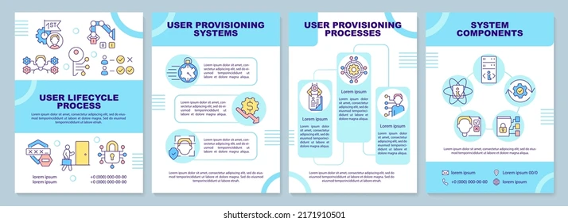

# 517-Synk-Brainstorm
Outline to brainstorm topic ideas for COM517 procedure project, and overlapping COM630 independent study.

## Intro

This repo is intended to be used as a tool to brainstorm ideas for topics for the procedures portion of our COM517 project. The content written for these procedures will also be used as text for the final project of my Independent Study. The paragraphs that follow will contain background description of these courses, how and why the final projects will overlap, and project goals.

### Background

This semester I am taking COM517-Advanced Technical Writing and COM630-Independent study, based on COM497-Designing Information Graphics. My intention in taking these two courses is to develop complimentary skills that will prepare me for my goal of working as a Technical Writer for a software technology company.

In COM517, I will develop the skill of writing technical content for diverse audiences while learning how to use industry-standard tools for docs-as-code and version control workflow, like Git, Github, VSCode, Markdown, DITA, and others.

In COM630, I will be studying design principles while learning tools like Adobe Illustrator, Adobe Indesign, and Adobe Framemaker for the creation of information graphics and documentation deliverables including manuals, books, and web pages.

### Purpose

My independent study advisor has encouraged me to develop a final project relevant to my desired field that will serve as a featured element in a portfolio. Because my goal is to work in software development as a Technical Writer, we decided to create 2 instructional booklets of 10 pages or more using Adobe InDesign. My work with the instructor will focus on mastering Indesign, and the design aspects of the booklet including text setting, visual components, and dynamic elements. The procedures that I write in ENG517 will serve as the text for the instructional booklets.

### Goals
- To select procedure topics that are relevant to Technical Writing -- see [Description](#description), below.
- To develop procedures with an eye toward the ENG517 final project as well as the Independent Study final project.
- To create instructional manual-style booklets using Indesign.

Sample technical manual: 

## Description

While the ENG517 project guidelines allow students to choose any topic for their procedures, the goal of the independent study will be to create an instructional manual booklet that can be used for future interviews. Since my goal is to work in software development, my advisor encouraged me to choose topics that would seem relevant to a recruiter or hiring manager at the kind of technology corporation I would like to work for.

### Challenges
The main challenge is that I do not have -- or at least, at the time of writing this cannot think of -- any specific technical knowledge that could be used in the creation of instruction manuals. So, part of the additional challenge will be doing enough research on new topics to write about them.

### Advantages
While I this approach will require additional time spent researching, it will present several advantages:

1. I will be getting real practice doing what a Technical Communicator does -- namely, taking information via research and subject matter expert interviews to create clear content that is easily understood by the designated audience.
2. I will be preparing myself for interviews, as these combined projects will make for useful talking points, and will lead to the creation of portfolio materials that can be referenced.
3. In the process of doing this research, I will be learning about topics that could be useful to me in future roles.

### Sources
I have several friends, including a sibling, who work for Red Hat. I could talk to them to get an idea of the products they use for workflow, as well as the products that they design/sell/support.

To start learning InDesign, I will be using the Linkedin Learning course title [InDesign 2024 Essential Training](https://www.linkedin.com/learning/indesign-2024-essential-training/indesign-learn-the-fundamentals-19871440?u=53565897)

## Potential Topic Ideas

1. Idea 1: Version Control Workflow 
2. Idea 2: The software development life cycle
3. Idea 3: AI - maybe description of how LLM models like ChatGPT work, or instructions on how to use a specific AI product
4. Idea 4: Product from a company I would like to work for (Red Hat, IBM, Google, Apple, Pendo)
5. Idea 5: Hardware - A smart phone? A computer? A printer? Something more involved/less common?
6. Idea 6: Other software - Is it too meta to make a booklet in Indesign about how to use Indesign? Is there an app I am particularly fond of that I could explain how to use to a non-technical audience?

